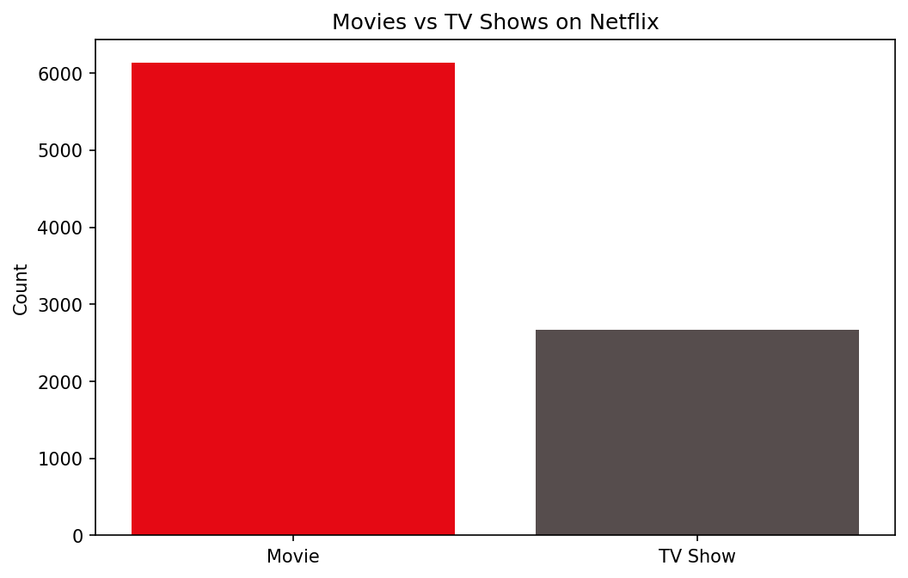
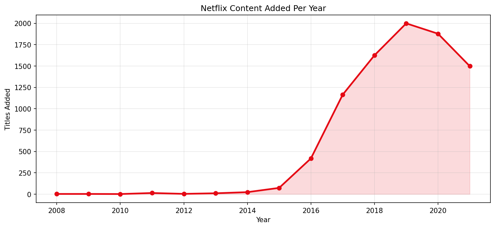
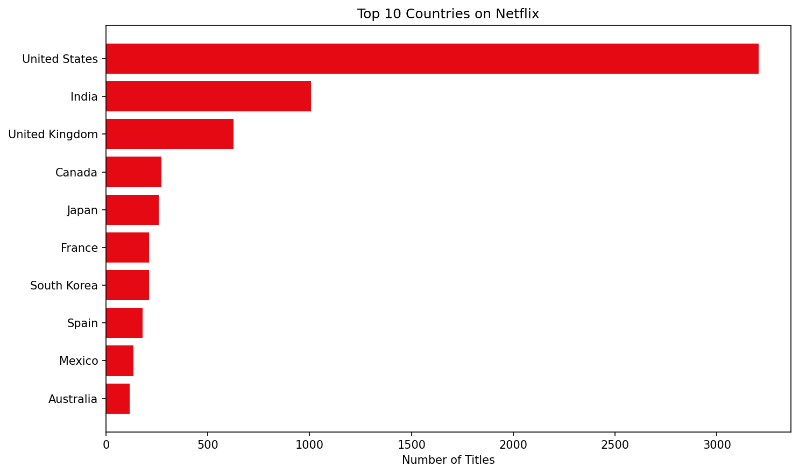
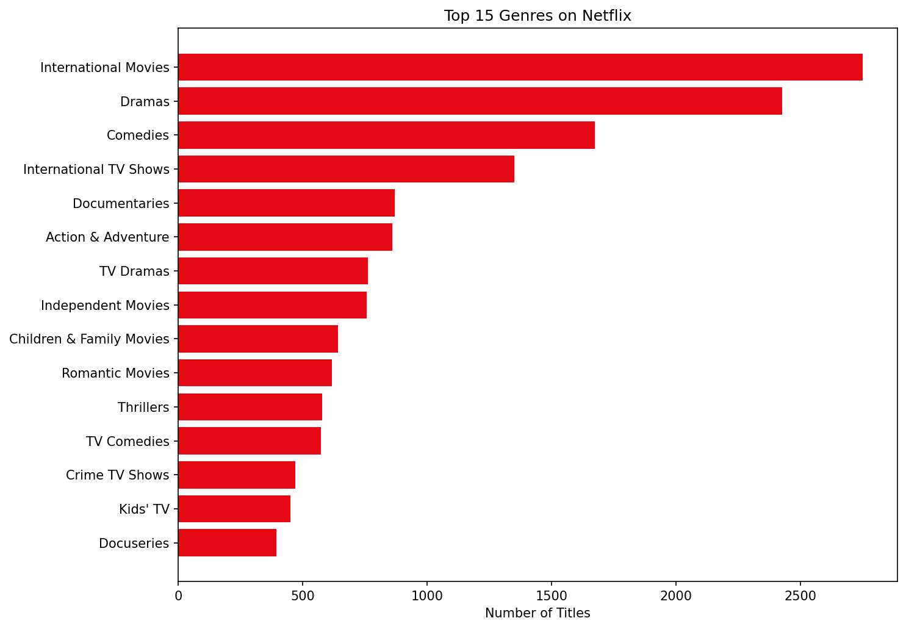
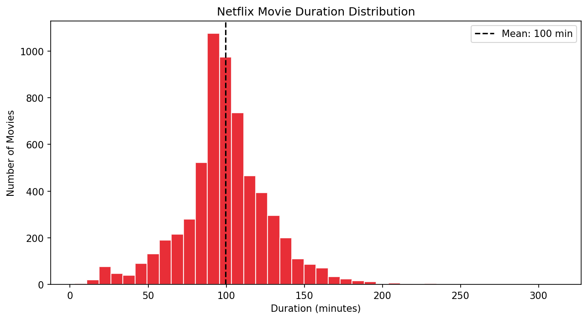
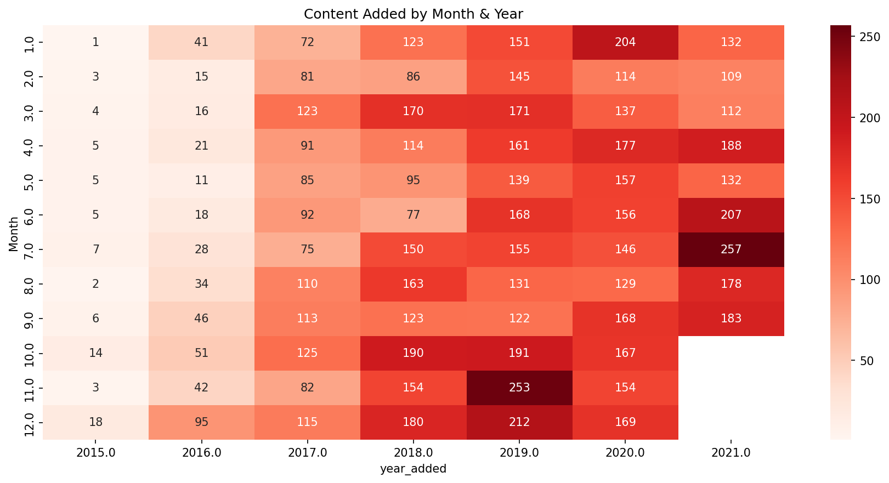
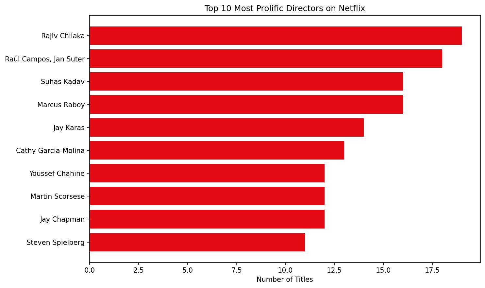

# 🎬 Netflix Movies & TV Shows Data Analysis using Python

## 📌 Project Overview

This project performs Exploratory Data Analysis (EDA) on the Netflix Titles Dataset to uncover trends in content production, genre popularity, country-wise distribution, and release patterns.

The analysis is performed using Python, Pandas, Matplotlib, and Seaborn.

---

# 📊 Project Objectives

- Analyze Netflix dataset
- Compare Movies vs TV Shows
- Explore release year trends
- Identify top genres
- Analyze country-wise content distribution
- Visualize insights using charts and graphs

---

# 🛠️ Technologies Used

- Python
- Pandas
- NumPy
- Matplotlib
- Seaborn
- Jupyter Notebook

---

# 📂 Project Structure

```text
Netflix-Data-Analysis/
│
├── dataset/
├── notebook/
├── images/
├── README.md
└── requirements.txt
```

---

## 📁 Dataset Information

- Total Records: 8,807
- Features: 12
- Types of Content: Movies and TV Shows
- Source: Kaggle Netflix Titles Dataset

Link:
https://www.kaggle.com/datasets/shivamb/netflix-shows

---

# 🚀 How To Run The Project

1. Clone the repository

```bash
git clone <your-repository-link>
```

2. Install required libraries

```bash
pip install -r requirements.txt
```

3. Launch Jupyter Notebook

```bash
jupyter notebook
```

4. Open:

```text
notebook/netflix_analysis.ipynb
```

---

# 📈 Key Insights

- Movies are more common than TV Shows on Netflix
- Netflix content increased rapidly after 2015
- United States has the highest content production
- Drama and International Movies are among the most popular genres

---

## 🧹 Data Cleaning

The following preprocessing steps were performed:

- Handled missing values
- Removed invalid records
- Converted date columns into datetime format
- Extracted Year Added and Month Added
- Processed genres for analysis


## 🔍 Exploratory Data Analysis

The project includes:

- Content Type Analysis
- Release Year Analysis
- Country-wise Content Distribution
- Genre Analysis
- Top Directors Analysis
- Duration Analysis
- Correlation Heatmap


---


# 📸 Sample Visualizations









---

## 📦 Requirements

- Python 3.x
- Pandas
- NumPy
- Matplotlib
- Seaborn
- Jupyter Notebook


---


# 🎯 Future Improvements

- Create Streamlit Dashboard
- Integrate Plotly Interactive Charts
- Build Content Recommendation Engine
- Deploy Project Online

---

## 💡 Skills Demonstrated

- Data Cleaning
- Data Visualization
- Exploratory Data Analysis (EDA)
- Feature Engineering
- Statistical Insights
- Python Programming


---

## 👨‍💻 Author

Shabaz

B.Tech AIML Student
Aspiring AI & Machine Learning Engineer

GitHub: <your-github-link>
LinkedIn: <your-linkedin-link>